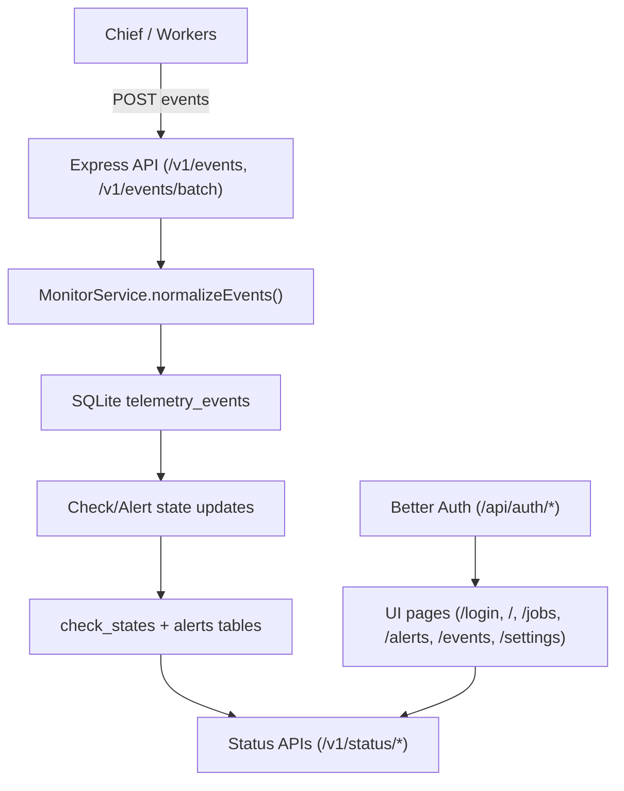

# Chief Monitor Technical Guide

This document is the deep technical reference for monitor backend and UI.

Scope:

- `monitor/src/*` (TypeScript API service)
- `monitor/src/db/*` (Drizzle + SQLite)
- `monitor/ui/*` (React dashboard)
- integration points from Chief telemetry

For operator quick start, use `../README.md`.
For endpoint contracts and examples, use `API_REFERENCE.md`.

## 1. System Purpose

Chief Monitor is an API-first observability service that:

- ingests telemetry events from Chief and workers
- persists telemetry and derived state in SQLite
- evaluates job health and alert conditions
- exposes status/query APIs
- serves integrated React UI from the same Express process

## 2. Technology Stack

Backend:

- Node.js + TypeScript
- Express
- Drizzle ORM
- better-sqlite3
- Zod request validation

Frontend:

- React + Vite + TypeScript
- TanStack Query
- TanStack Table
- Recharts
- React Router

Database:

- SQLite with WAL mode enabled

## 3. High-Level Architecture

## 4. Runtime Entry Point and Boot Sequence

Main file: `monitor/src/server.ts`

Boot order:

1. `loadConfig()` from env
2. `runMigrations(config.dbPath)` executes SQL bootstrap
3. `createDbClient(config.dbPath)` opens SQLite and enables pragmas
4. Construct Better Auth module and seed admin user (when auth enabled)
5. Construct `MonitorService(db, config)`
6. Register auth and API routes
7. Register static UI serving if `ui/dist/index.html` exists
8. Start background loops from `service.startBackgroundLoops()`
9. Bind Express server

Shutdown behavior:

- on `SIGINT` or `SIGTERM`:
  - clear background intervals
  - close HTTP server
  - close SQLite handle

## 5. Configuration Model

Config loader: `monitor/src/config.ts`

Environment variables:

- `MONITOR_HOST` (default `127.0.0.1`, Render default `0.0.0.0`)
- `MONITOR_PORT` (default `7410`, falls back to `PORT` when present)
- `MONITOR_DB_PATH` (default `./monitor.sqlite`)
- `MONITOR_API_KEY` (default empty)
- `MONITOR_AUTH_ENABLED` (default `true`)
- `MONITOR_AUTH_SECRET` (required when auth enabled)
- `MONITOR_AUTH_BASE_URL` (optional public URL for auth origin checks; defaults to `RENDER_EXTERNAL_URL`/`BETTER_AUTH_URL` when set)
- `MONITOR_AUTH_TRUSTED_ORIGINS` (optional comma-separated extra origins)
- `MONITOR_AUTH_ADMIN_EMAIL` (required when auth enabled)
- `MONITOR_AUTH_ADMIN_PASSWORD` (required when auth enabled)
- `MONITOR_RESEND_API_KEY` (optional, required for email sending)
- `MONITOR_RESEND_FROM_EMAIL` (optional, required for email sending)
- `MONITOR_RESEND_API_BASE` (optional, default `https://api.resend.com`)
- `MONITOR_RETENTION_DAYS` (default `30`)
- `MONITOR_EVALUATOR_INTERVAL_SECONDS` (default `15`)
- `MONITOR_RETENTION_INTERVAL_SECONDS` (default `3600`)

Integer parser accepts only positive ints, otherwise falls back to defaults.
When `MONITOR_AUTH_ENABLED=true`, startup fails fast if required auth env vars are missing.

## 6. Database Layer

Schema sources:

- SQL bootstrap: `monitor/drizzle/0000_init.sql`, `monitor/drizzle/0001_auth.sql`
- Drizzle schema: `monitor/src/db/schema.ts`

Client creation: `monitor/src/db/client.ts`

- Sets `journal_mode = WAL`
- Enables `foreign_keys = ON`
- Builds Drizzle client from schema

### 6.1 Core Tables

`telemetry_events`

- raw event stream from all sources
- stores event payload and metadata JSON

`check_states`

- per-job derived health state
- status machine: `UP | LATE | DOWN`
- expected schedule and heartbeat context

`alerts`

- open/closed alert lifecycle records
- types: `FAILURE | MISSED | RECOVERY`
- dedupe key to avoid repeated open duplicates

`alert_deliveries`

- delivery attempts for channels such as webhook stub and email (`SENT` / `FAILED`)

`service_config`

- persisted runtime overrides, including `alert_email_settings`

`user`, `session`, `account`, `verification`

- Better Auth identity/session tables used by web login

### 6.2 Indexing

Important indexes:

- `telemetry_events(job_name, event_at)`
- `telemetry_events(level, event_at)`
- `telemetry_events(run_id)`
- `alerts(status, opened_at)`
- `alerts(job_name, status)`
- `alerts(dedupe_key, status)`
- `check_states(status, updated_at)`

## 7. API Surface and Validation

Validation uses Zod schemas in `monitor/src/server.ts`.

### 7.1 Ingest Endpoints

- `POST /v1/events`
- `POST /v1/events/batch`

Auth:

- If `MONITOR_API_KEY` is set, these endpoints require `x-api-key`.
- If `MONITOR_API_KEY` is empty, these endpoints remain open.

### 7.2 Read/Status Endpoints

- `GET /v1/health`
- `GET /v1/status/summary`
- `GET /v1/status/jobs`
- `GET /v1/status/jobs/:jobName`
- `GET /v1/alerts`
- `GET /v1/events`
- `GET /v1/settings/alerts/email`

Auth rule:

- `/v1/health` is unauthenticated.
- non-ingest `/v1/*` endpoints allow either:
  - valid Better Auth session cookie, or
  - valid `x-api-key`

### 7.3 Alert Mutation Endpoint

- `POST /v1/alerts/:alertId/close`
  - body: optional `{ "reason": "..." }`
  - returns not-found vs updated status payload

### 7.4 Alert Email Settings Endpoints

- `PUT /v1/settings/alerts/email`
  - body: `{ recipients: string[]; enabledAlertTypes: ("FAILURE"|"MISSED"|"RECOVERY")[] }`
- `POST /v1/settings/alerts/email/test`
  - sends test email to configured recipients
  - returns `{ attempted, sent, failed, message }`

## 8. Ingestion and Normalization Pipeline

Core method: `MonitorService.normalizeEvents(rawEvents)`

Normalization guarantees:

- validates enumerated `sourceType` and `level`
- requires non-empty `message` and `eventType`
- fills missing `eventAt` with current timestamp
- coerces optional fields to nullable forms
- strips malformed metadata to `{}` fallback

Ingestion method: `ingestEvents(rawEvents)`

- inserts normalized rows into `telemetry_events`
- for each inserted event, executes `applyEventToChecks(event)`
- returns counts: `{ inserted, dropped }`

## 9. Event Producers and Contracts

Primary producers:

- Chief lifecycle events
- worker custom events from `chief/monitor_client.py`

Common Chief event types:

- `job.started`
- `script.started`
- `script.completed`
- `job.completed`
- `job.failed`
- `job.next_scheduled`
- `daemon.dispatch`
- `daemon.overlap_skipped`
- `daemon.queued_pending`
- `chief.heartbeat`

Worker helper event type:

- `worker.message`

Worker helper behavior (`chief/monitor_client.py`):

- reads context env vars injected by Chief:
  - `CHIEF_MONITOR_ENDPOINT`
  - `CHIEF_MONITOR_API_KEY`
  - `CHIEF_RUN_ID`
  - `CHIEF_JOB_NAME`
  - `CHIEF_SCRIPT_PATH`
  - `CHIEF_SCHEDULED_FOR`
- sends `POST /v1/events` directly
- best-effort only, returns `False` on transport failures

## 10. Check State Engine

Primary input events:

- `job.started`
- `job.completed`
- `job.failed`
- `job.next_scheduled`

Derived behavior:

1. Ensure check row exists (`ensureCheckState`)
2. On `job.next_scheduled`:
  - update `expected_next_at`
3. On heartbeat events:
  - set `last_heartbeat_at`
  - set status `UP`
  - process miss/failure recovery transitions

Config source for check behavior:

- read from event metadata keys:
  - `check_enabled`
  - `grace_seconds`
  - `alert_on_failure`
  - `alert_on_miss`

This lets Chief control check policy per job without monitor-side schedule parsing.

## 11. Alert Engine Internals

Alert opening helper: `openAlert(...)`

- dedupes by `(dedupeKey, status=OPEN)`
- inserts open alert if not already open
- inserts `alert_deliveries` webhook stub row
- asynchronously attempts email delivery for enabled alert types
  - uses `service_config` key `alert_email_settings`
  - never blocks ingest or check evaluation on email send failures

Alert closing helper: `closeOpenAlerts(jobName, type)`

- closes all matching open alerts with `closedAt`

### 11.1 Failure Lifecycle

On failed completion:

- increment `consecutive_failures`
- optionally open `FAILURE` alert

On later success:

- reset failure counter
- close open `FAILURE`
- open `RECOVERY` for failure recovery

### 11.2 Missed Lifecycle

Periodic evaluator (`evaluateChecks`) computes:

- `DOWN` when `now > expected_next_at + grace_seconds`
- `LATE` when `0 < now - expected_next_at <= grace_seconds`
- `UP` otherwise

When crossing to `DOWN`:

- optionally open `MISSED`

On later heartbeat:

- close `MISSED`
- open `RECOVERY` for missed recovery

### 11.3 Recovery Closing Strategy

Recovery alerts are transient:

- closed on the next heartbeat for the same job
- TTL fallback closes stale open recovery alerts after `900s` default

### 11.4 Manual Close

Method: `closeAlertById(alertId, reason)`

- returns `{ found, updated, reason, alert }`
- no-op update if already closed

## 12. Chief Presence Summary Logic

Summary endpoint computes Chief runtime presence from `chief.heartbeat` events.

Algorithm:

1. fetch latest `chief.heartbeat` event
2. parse `metadata.ping_interval_seconds` if present
3. compute `offlineAfterSeconds`:
  - if interval known: `max(5, interval * 2)`
  - else fallback `45`
4. `online = now - lastHeartbeatAt <= offlineAfterSeconds`

Returned in `GET /v1/status/summary`:

- `chief.online`
- `chief.lastHeartbeatAt`
- `chief.pingIntervalSeconds`
- `chief.offlineAfterSeconds`

## 13. Background Maintenance Loops

`startBackgroundLoops()` returns interval handles:

1. Evaluator loop:
  - every `config.evaluatorIntervalSeconds`
  - runs `evaluateChecks()`
2. Retention loop:
  - every `config.retentionIntervalSeconds`
  - runs `pruneTelemetry(config.retentionDays)`

Retention:

- deletes `telemetry_events` older than retention cutoff
- alerts/checks are retained

## 14. UI Architecture

App root: `monitor/ui/src/App.tsx`

Routing:

- `/login` -> `LoginPage`
- `/` -> `OverviewPage`
- `/jobs` -> `JobsPage`
- `/jobs/:jobName` -> `JobDetailPage`
- `/alerts` -> `AlertsPage`
- `/events` -> `EventsPage`
- `/settings` -> `SettingsPage`

Data fetching:

- TanStack Query with polling every 10s (`visiblePollingInterval()`)
- polling paused when browser tab not visible

State behavior:

- each page owns local filter/pagination state
- filter submissions reset page index
- manual close mutations invalidate query caches

Generic table rendering:

- `DataTable` component wraps TanStack Table
- supports empty-state handling and CSS class extension

## 15. API Contract Used by UI

Typed contract source: `monitor/ui/src/lib/types.ts`

Key response models:

- `SummaryResponse`
- `JobsStatusResponse`
- `JobDetailsResponse`
- `AlertsResponse`
- `EventsResponse`
- `CloseAlertResponse`
- `AlertEmailSettingsResponse`
- `AlertEmailTestResponse`

API client source: `monitor/ui/src/lib/api.ts`

- `getSummary`, `getJobsStatus`, `getJobDetails`
- `getAlerts`, `getEvents`
- `closeAlert`
- `getAlertEmailSettings`, `updateAlertEmailSettings`, `sendTestAlertEmail`

Session behavior:

- browser UI authenticates via Better Auth cookie session (`/api/auth/*`)
- UI API requests use same-origin credentials (no browser-stored monitor API key)

## 16. Integrated Serving Model

Server resolves UI dist path candidates:

1. `monitor/dist` relative path
2. workspace-relative fallback
3. process cwd fallback

If `ui/dist/index.html` exists:

- serves static assets
- SPA fallback for non-`/v1` and non-`/api/auth` routes

If missing:

- logs warning and runs API-only mode

## 17. Build, Test, and Dev Workflow

Backend commands (`monitor/package.json`):

- `npm run dev` (tsx server)
- `npm run build` (tsc backend compile)
- `npm run start` (run compiled backend)
- `npm run db:migrate`

UI commands:

- `npm run ui:dev`
- `npm run ui:build`

UI tests:

- `npm --prefix monitor/ui test`

Note:

- current UI TS build emits JS artifacts alongside some TS files in `monitor/ui/src`.
- keep `.gitignore` and commit strategy consistent with your team preference.

## 18. Security Model (Current State)

Current security boundaries:

- Better Auth protects browser UI/API access with user sessions
- telemetry ingest (`/v1/events*`) can remain machine-key based via `MONITOR_API_KEY`
- non-ingest `/v1` endpoints accept session cookie or API key

Implications:

- suitable for local/internal trusted deployment
- for shared environments, prefer stronger identity (proxy auth/OIDC/JWT) over shared API key

## 19. Extension Points

Common extensions:

1. New alert rules:
  - add transitions in `applyEventToChecks` or `evaluateChecks`
  - add new `alertType` taxonomy and UI filters

2. External notifications:
  - add retry queue or additional channels (Slack/PagerDuty)
  - keep `alert_deliveries` as source of attempt outcomes

3. Multi-tenant support:
  - add tenant key on events/checks/alerts and query filters

4. Authentication:
  - add role-based authorization for settings mutation or admin-only controls

5. Time-series analytics:
  - add rollup tables/materialized views for trend charts

## 20. Known Constraints

- SQLite single-node design, no clustering semantics.
- Schedule understanding comes from Chief events, not independent schedule parsing.
- Telemetry quality depends on producer event quality and delivery availability.
- Alert dedupe is key-based, so event dedupe beyond that is not implemented.
